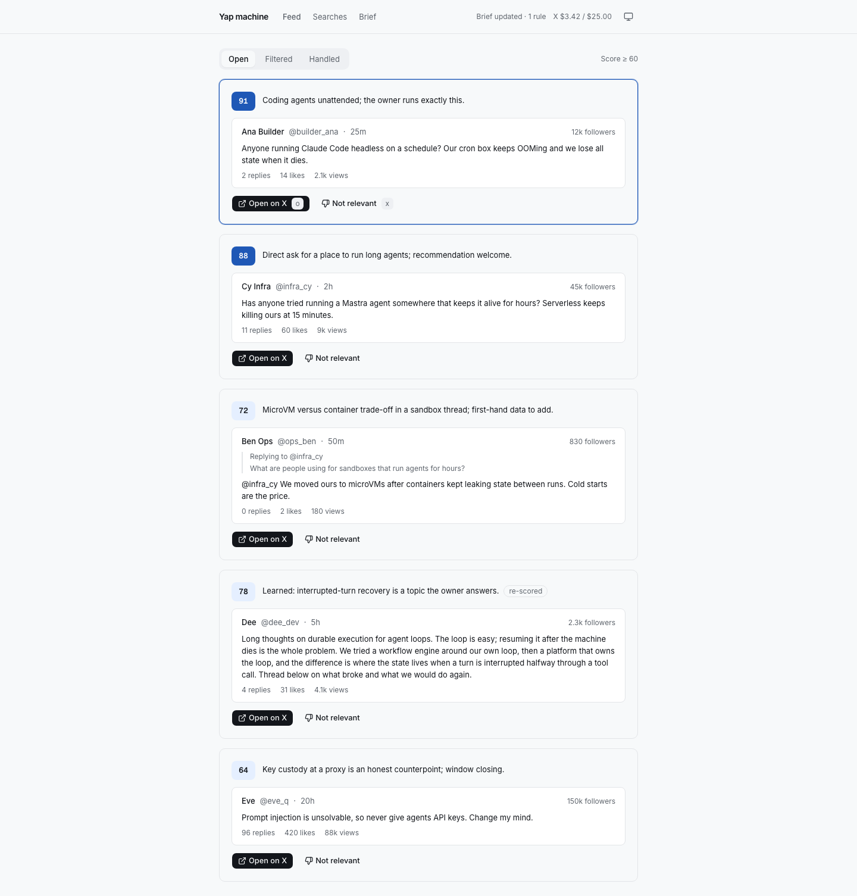

# Yap machine

A feed of the posts on X worth answering. An [OpenComputer](https://docs.opencomputer.dev/agents/overview)
agent searches X for you, scores each new post against a brief you write,
and a small app ranks what's left. You read the post, open it on X, and
reply yourself. Nothing here writes or posts for you.



## How it works

```
saved X searches ──► scout run (OpenComputer agent) ──► app ──► database
                      fetches new posts, scores each         │
you ◄── feed: Open · Filtered · Handled ◄────────────────────┘
 └──► Not relevant / Relevant ──► learning run turns your marks into rules in the brief
```

- **Searches** are saved X queries: a watchlist of people, a competitor, a
  topic. Each keeps a cursor, so a post is fetched and paid for once.
- **A scout run** fetches new posts for every search that is due and scores
  each from 0 to 100 against your brief: is it on your topics, and can you
  add something to it.
- **The feed** shows posts scoring 60 or more in *Open*, ranked by score and
  freshness, and the rest in *Filtered*.
- **Your marks teach it.** Mark an Open post *Not relevant*, or a Filtered
  one *Relevant*, with an optional note. The next scout run reads your marks
  as examples, and a learning run folds them into short rules in your brief,
  then re-scores the feed.

## The agent

The agent is a TypeScript function in
[`agent.ts`](opencomputer/agents/yap/agent.ts). OpenComputer calls it before
each model step and runs everything around it: the model, the tool calls,
the session. The function only decides the model, the tools and the
instructions, here from the [payload](https://docs.opencomputer.dev/agents/inputs)
that started the session (abridged):

```ts
export default function Yap() {
  const input = useInput();
  useModel("anthropic/claude-sonnet-5.5");
  const role = roleOf(input.payload);
  if (role === "scout") {
    useTool(getWork);
    useTool(runSearch);
    useTool(nextPosts);
    useTool(submitJudgments);
    useTool(report);
    return SCOUT_INSTRUCTIONS;
  }
  // role === "learning": the tools that turn marks into rules
}
```

A session started without a role gets no tools at all.

**Tools do the work; the model judges.** [Tools](https://docs.opencomputer.dev/agents/tools) are plain
TypeScript. [`run_search`](opencomputer/agents/yap/tools/run-search.ts)
takes only a search id: it claims the search from the app, calls X with the
stored query and cursor, and hands the posts to the app. The model gets
counts back, then reads posts in batches of 25 and submits a score and a
one-line reason for each. It never sees a query, a cursor or a key, and it
can only score posts the app holds.

**Keys stay outside the agent.** The X API is a declared connection with its
token as a [secret](https://docs.opencomputer.dev/agents/secrets)
([`connections/x.ts`](opencomputer/agents/yap/connections/x.ts)):

```ts
export const xApi = defineConnection({
  id: "x-api",
  origin: "https://api.x.com",
  methods: ["GET"],
  pathPrefix: "/2/",
  headers: { Authorization: bearer(useSecret("X_BEARER_TOKEN")) },
});
```

OpenComputer attaches the token at its outbound proxy, only for GET requests
to `api.x.com/2/`. Every post the agent reads was written by a stranger; a
post that tries to talk the model into leaking a key finds none in its
reach. The app's own token works the same way.

**Runs start from a schedule or from the app.** In production the scout runs
on a [schedule](https://docs.opencomputer.dev/agents/schedules)
([`schedules/scout.ts`](opencomputer/agents/yap/schedules/scout.ts), abridged):

```ts
export default defineSchedule({
  id: "scout",
  cron: "*/5 * * * *",
  overlap: "skip",
  dispatch: { text: "Work the searches that are due.", payload: { role: "scout" } },
});
```

The app's Refresh button, and the learning runs after you mark posts, start
the same agent through the [API](https://docs.opencomputer.dev/agents/api): a new
[session](https://docs.opencomputer.dev/agents/sessions) and one turn with a payload.

**The report is the session's result.** The run ends by calling `report`, a
[result tool](https://docs.opencomputer.dev/agents/tools#the-session-result) whose output schema
OpenComputer checks before committing it, so every run leaves a structured
record: searches run, posts stored and scored, and a note.

`npm run deploy:agent` builds the agent directory into an immutable
[deployment](https://docs.opencomputer.dev/agents/deployments); every session stays on the deployment it
started with.

## Run it locally

The app and its database run on your machine. The agent runs in your
OpenComputer project, in the cloud, and calls the app back over HTTPS, so
the app needs a public address: an [ngrok](https://ngrok.com) tunnel on the
fixed domain every free ngrok account gets.

### You need

- Node 22, and the [ngrok CLI](https://ngrok.com/download) with your
  authtoken added (`ngrok config add-authtoken <token>`).
- Your ngrok domain, from the ngrok dashboard under **Domains**, such as
  `https://your-words.ngrok-free.app`.
- An OpenComputer account; sign in with `npx opencomputer login`.
- An X developer app on [pay-per-use](https://docs.x.com/x-api/getting-started/pricing)
  with credits loaded.

### Keys and settings

| Name | Where it goes | Required | What it is |
|---|---|---|---|
| `X_BEARER_TOKEN` | `opencomputer/.env.local` | yes | Your X app's **Bearer Token**: X developer portal → your app → **Keys and tokens**. The app-only one, starting `AAAA…`; not the API key and secret, not an access token. |
| `OPENCOMPUTER_API_KEY` | `.env.local` | yes | An API key for your OpenComputer organization, from the dashboard. The app uses it to start the agent's runs. |
| `YAP_PUBLIC_ORIGIN` | `.env.local` | yes | Your ngrok domain, e.g. `https://your-words.ngrok-free.app`: the address the agent reaches the app at. |
| `YAP_AGENT_TOKEN` | both `.env.local` files | yes | Written by `npm run setup`. The agent presents it to the app; you don't need to set it. |
| `SUPABASE_URL`, `SUPABASE_SECRET_KEY` | `.env.local` | no | A hosted Supabase project instead of the local database. |
| `YAP_SCORE_THRESHOLD` | `.env.local` | no | The score a post needs to reach Open. Default 60. |

`npm run secrets` uploads `X_BEARER_TOKEN` and `YAP_AGENT_TOKEN` to
OpenComputer, which attaches them to the agent's outgoing requests. The rest
stay on your machine.

### Set up, once

```bash
npm install
cp .env.example .env.local                           # YAP_PUBLIC_ORIGIN, OPENCOMPUTER_API_KEY
cp opencomputer/.env.example opencomputer/.env.local # X_BEARER_TOKEN
npx opencomputer link --create-project yap-machine
npm run setup
npm run secrets
npm run deploy:agent
```

| Step | What it does |
|---|---|
| `link` | Creates your OpenComputer project for the agent. |
| `setup` | Local files only. Generates the token the agent presents to the app, into both `.env.local` files, and writes your ngrok domain into the agent's connection to the app. Lists anything still missing. |
| `secrets` | Uploads `X_BEARER_TOKEN` and the agent token to your project. OpenComputer attaches them to the agent's outgoing requests; the agent's code never sees them. |
| `deploy:agent` | Deploys the agent to your project's development environment. Run it again after changing anything under `opencomputer/`. |

If your ngrok domain changes, run `setup`, `secrets` and `deploy:agent`
again.

### Run

```bash
npm run dev      # terminal 1: the app on http://localhost:3300, with its database
npm run tunnel   # terminal 2: ngrok from your domain to the app
```

The first time, load a brief and its searches. `brief.example.md` is a
sample for a made-up product; copy it, make it yours, and load your copy:

```bash
cp brief.example.md brief.local.md
npm run seed:brief -- brief.local.md
```

Open http://localhost:3300 and press **Refresh**. The button shows the run
as it goes (searching X, then scoring) and reloads the feed when it's done,
usually within a minute or two.

## Using the feed

| Action | Key | What happens |
|---|---|---|
| Reply | `c` | Opens X's reply box for the post in a small window. You write and post it there, as yourself. |
| Open on X | `o` | Opens the post on X in a new tab. |
| Not relevant (Open) | `x` | Asks for an optional note, then moves the post to Handled. The agent learns from it. |
| Relevant (Filtered) | `r` | The same, the other way. |
| Done | `d` | Moves the post to Handled with no verdict. Nothing is learned; use it for posts you've answered already or want to skip. |
| Why it's here | | Shows the agent's one-line reason. |
| Move | `j` `k` | Selects the next or previous post. |

Replies go through X's own composer because X pages can't be embedded, and
X's API only takes a reply from an account the author has mentioned.

## Your brief and searches

The brief says who you are, what your product is, which topics and people
matter, and what to find and skip. `brief.example.md` shows the sections.
`seed:brief` loads the brief and turns its **Searches** table into saved
searches; the model never sees that table.

After loading, both live in the app's database: edit them on the **Brief**
and **Searches** screens. Every brief change makes a version you can diff
and restore, and each learned rule shows the marks behind it. Your brief
and queries stay out of Git; `*.local.md` files are ignored.

Each search runs on its own interval, from 5 minutes to a day. Refresh runs
every search not run in the last five minutes.

## What it costs

- **X API:** pay-per-use, drawn from the credits you load in the X developer
  portal: $0.005 for each post and $0.01 for each user a search returns,
  charged once per UTC day. A search fetches only posts newer than its last
  run, so a post is paid for once. The app has no spending cap of its own:
  when your credits run out, searches fail until you top up.
- **OpenComputer:** the agent's model calls and machine time, billed to your
  OpenComputer organization.

## The app

- **The app** (`src/`) is TanStack Start, built for Cloudflare Workers. The
  browser talks only to the app's routes; the agent reaches `/api/agent/*`
  with its token. Through the tunnel, only those routes answer.
- **The database** (`supabase/migrations/`) is Postgres. Every write is one
  function, so each is a single transaction. Locally it runs in PGlite
  (Postgres compiled to WebAssembly) under `dev/local/.pglite`, so you need
  no database account; delete that directory to start over. To use a hosted
  Supabase project, apply `supabase/migrations/` and set `SUPABASE_URL` and
  `SUPABASE_SECRET_KEY` in `.env.local`.

`AGENTS.md` maps the code in more detail.

## Commands

| Command | What it does |
|---|---|
| `npm run dev` | The app and its local database. |
| `npm run tunnel` | ngrok from your domain to the app. |
| `npm run seed:brief -- <file>` | Loads a brief and its searches. |
| `npm run scout:once` | Starts a scout run from the terminal, like Refresh. |
| `npm run rejudge` | Clears the scores of posts you haven't handled, so the next run scores them again under your current brief. Model time only; X isn't searched again. |
| `npm run avatars` | Fills in profile pictures for posts stored before the app kept them ($0.01 per author). |
| `npm run dev:sample` | The app over sample data on http://localhost:3310. No agent or setup needed. |
| `npm run check` | Typecheck, lint, tests and build, as CI runs them. |
| `npx playwright test --config dev/playwright.config.ts` | Captures every screen into `dev/design/screens`. |

## Deploying

Running the app on Workers, behind Cloudflare Access, isn't documented yet.
Until then, run it locally.

## License

[MIT](LICENSE)
